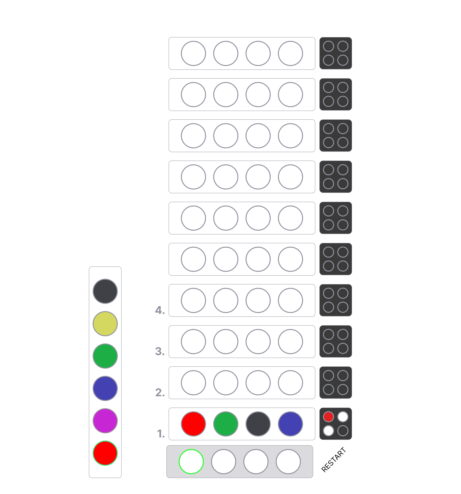
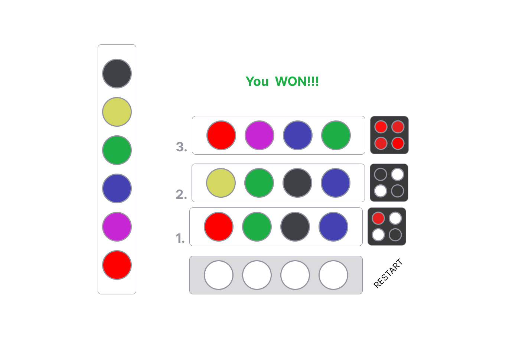

# Mastermind Pseudocode
[Live Link] (https://natasharodic.github.io/mastermind/)
---

---

1. **Define Constant variables for the game:**
   1. Create and set **MAX_ATTEMPTS** variable to 10.
   2. Create **COLOR_PICKED** variable which will hold the value of 6 different colors.

---

2. **Define state variables for the game:**
   1. Create variable **playersBoard** and set its value to an empty array.
   2. Create variable **feedbackBoard** and set its value to an empty array.
   3. Create variable **currentguess**.
   4. Create variable **result**.
   5. Create **winComb** variable.
   6. Create **sampleboard** variable

---

3. **Store elements that will be used more than once in the code:**
   1. Store the element in a variable that will display the winning message or next guess.
   2. Store the button in a variable **play**.
   3. Store circle elements displayed on the side that represent 6 colors that the player can choose from.

---

4. **Upon loading the page, our app should:**
   1. Initialize the state variables:
      - Initialize the **playersBoard(left white)** array to 10 arrays with 4 elements and set its value to null.
      - Initialize the **feedbackBoard(right-black)** array to 10 arrays with 4 elements and set its value to null.
      - Initialize the **sampleboard**
        - set currentField to 0
      - Initialize the **currentguess** variable to 0.
      - Initialize **result** value to null.
   2. Generate the winning combination. ( chose 4 out of 6 colors)
   3. Render those variables to the page:
      - Render the players' board (create a render function for this).
      - Render the feedback board (create a render function for this).
      - Render the winning message.
      - Wait for the user to pick colors and create the combination.

---

5. **Handle the user clicking on colors and creating the combination:**

   1. Get the colors that the player picked.
      1. Set **sampleBoard(currentField)** = clicked color
      2. continue until currentField==3; when currentField==3, run checkCombination()
   2. (checkCombination()) After the player's input, compare the player's combination with the winning combination:
      1. If the guess matches the winning combination, display the win message, and end the game.
      2. If the guess does not match, generate the feedback board based on the guess:
         - Count the number of correct colors in the correct position (red pins).
         - Count the number of correct colors only (white pins).
         - If no match, return null.
         - Display pins with colors on the feedback board.
      3. Increment the current attempt by 1.

   **Repeat the Game function until the winner combo and the player's combo match or until the current attempt variable equals MAX_ATTEMPTS constant.**

   1. Display a message if the player did not guess the combination.
   2. Prevent the user from picking the colors.

---

6. **Handle a player clicking the replay button:** When the replay button is clicked:
   1. Reset all state variables.
   2. Generate a new winning combination.
   3. Render game elements to the page.

---

---

# Mastermind Wireframe

---

---

## Screen 1

---

## Screen 2

