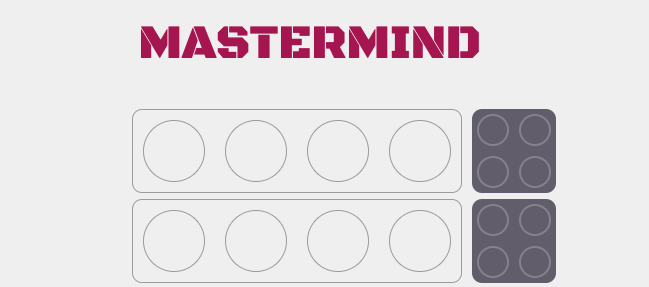
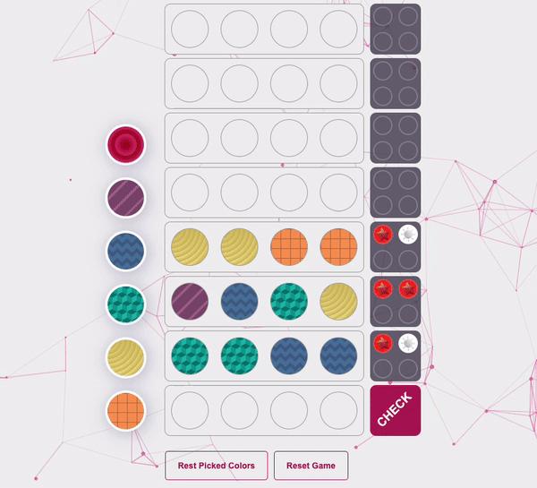
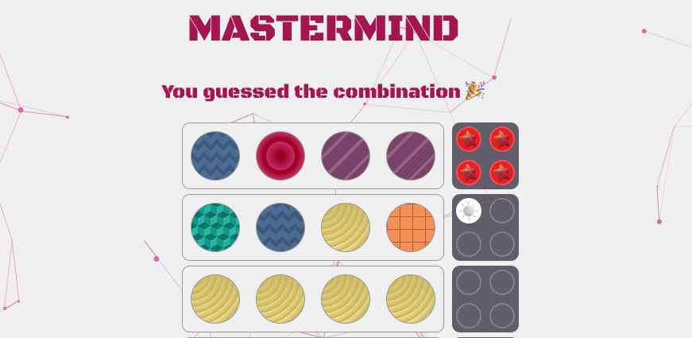
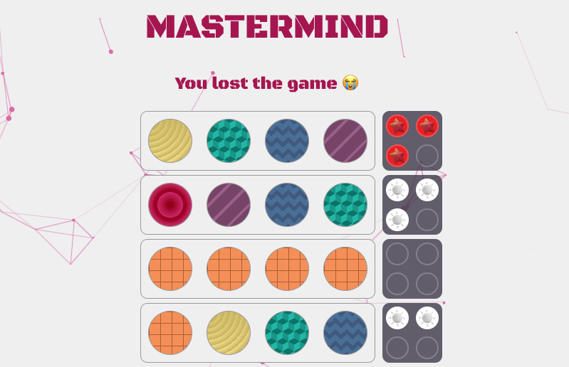

  

  

# MASTERMIND

### [CLICK TO PLAY](https://natasharodic.github.io/mastermind/)

#### Natasha Rodic

## 📝 Description

 

This is a Mastermind game. The Mastermind game consists of a code maker and a code breaker. The user, as a player, takes on the role of the code breaker, while the computer serves as the code maker, generating a random code. Players have up to ten attempts to guess the code in order to win. After each guess (combination), the code maker (computer) provides feedback, informing the user of the number of colors in the correct position or the number of correct colors guessed in the combination.

**CODE:**
This game was built in JS, CSS, and HTML. The game was constructed using the Data-Centric Approach, where the development phase commenced with a highly detailed pseudo-code. Comments and well-structured code were utilized, along with the use of CSS Variables.

**ACCESSIBILITY:**
For accessibility reasons, the game employed not only colors but also patterns and sounds, which allow users with color vision difficulties to navigate and comprehend content effectively. With colors, patterns, and sounds, it provides multiple sensory channels for users to receive information effectively.

**DESIGN:**
Regarding design, the game features particles in the background and a simple design with a color palette of pink, gray, and white. Additionally, in this game, we used three breakpoints to ensure responsiveness. We began with the principle of mobile-friendly design first and then incorporated additional breakpoints for tablets and computers.

---

## 📸 Screenshots of the game

    
Wireframes

   
   ## Screen 1

---

## Screen 2

### Main Screen

### You guessed the combination - screen

### You lost the game - screen

---

## 💻 Technologies used

- 
- 
- 
- 
- 
- 
- 

---

## Getting started [ ▶️](https://natasharodic.github.io/mastermind/)

1. Pick Color Combination: Choose four colors from the sidebar to begin.

2. Check Your Guess: Click "Check" to see if your combination matches the winning one.

3. Get Feedback: Receive feedback with red and white pegs.
   Red pegs indicate correct color and position.
   White pegs mean correct color but wrong position.
   No pegs mean no correct guesses.

4. Keep trying: Guess up to ten times to win, or continue trying until you succeed within ten attempts. If you reach the maximum of ten guesses without guessing the combination, you lose.

---

## Next Steps

- Tutorials and Instructions

- Score Tracking

- Difficulty Levels

---
